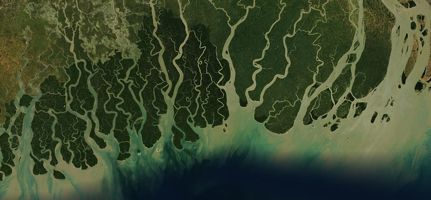

# Orbit

This is a collection of wallpapers for mobile devices, derived from satellite imagery of the world's interesting geographies.

### Credit

Pictures are from [MapBox Satellite](http://mapbox.com/blog/mapbox-satellite/), a global imagery map layer from [MapBox](http://mapbox.com) and derived from open datasets such as Landsat, NAIP, and USGS HRO.
