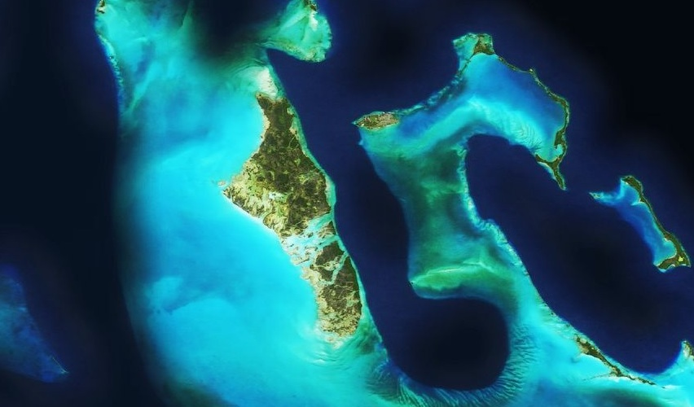

# Andros

The Bahamian island of [Andros](http://en.wikipedia.org/wiki/Andros,_Bahamas) is actually an archipelago, and the largest in the island nation. To the east is the [Tongue of the Ocean](http://en.wikipedia.org/wiki/Tongue_of_the_Ocean), a mile deep trench surrounded by shoals and shallows.

