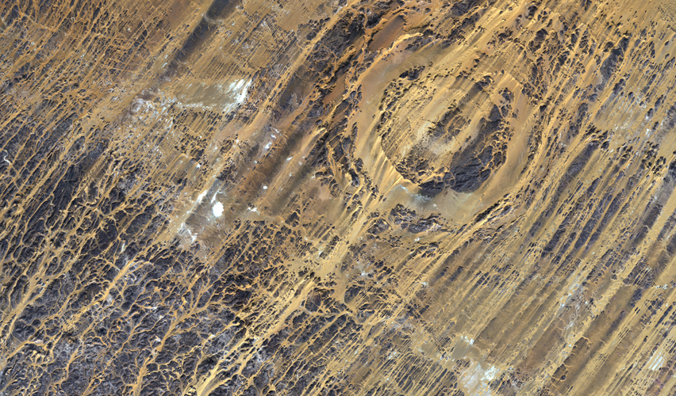

# Aorounga Crater

The [Aorounga crater](https://en.wikipedia.org/wiki/Aorounga_crater) in northern Chad was formed by a meteorite impact over 300 million years ago. South of the [Tibesti Mountain Range](https://en.wikipedia.org/wiki/Tibesti_Mountains), the crater is 12 km across. This image was taken by Japan's ALOS platform in late 2013.

[View Map](http://a.tiles.mapbox.com/v3/colemanm.map-h3n78ecg.html#10/19.1024/19.2151)

Source: [JAXA ALOS (Daichi)](http://www.esa.int/spaceinimages/Images/2013/11/Aorounga_Crater_Chad)
