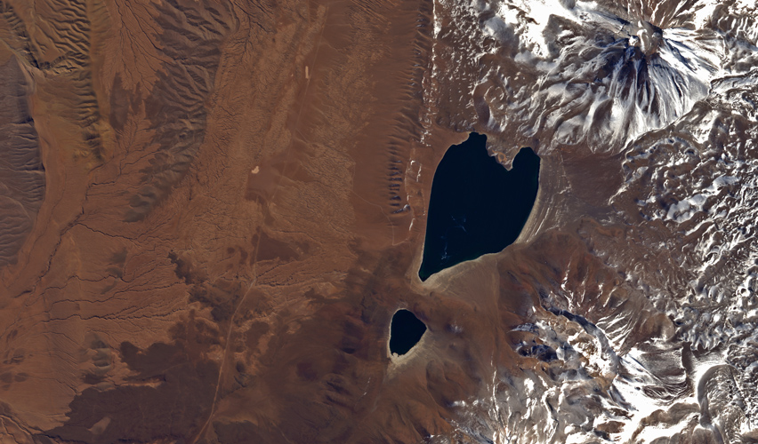

# Atacama

The Atacama Desert is the driest hot desert on Earth, and stretches over 1000km of Chile and Peru west of the Andes. The brackish [Lake Miscanti](https://en.wikipedia.org/wiki/Miscanti_Lake) is visible in the center, with its smaller sibling Miñiques Lake to the south. The volcanoes of [Miñiques](https://en.wikipedia.org/wiki/Mi%C3%B1iques) and [Cerro Miscanti](https://en.wikipedia.org/wiki/Cerro_Miscanti) are on the edge of the scene.

Areas of the Atacama often serve as substitutes for the Martian landscape in film, due to the resemblance to the red planet's surface.

[View Map](http://a.tiles.mapbox.com/v3/colemanm.map-h3n78ecg.html#10/-23.7514/-67.8090)

Source: [JAXA ALOS (Daichi)](http://www.esa.int/spaceinimages/Images/2014/02/Heart_of_the_Atacama)
