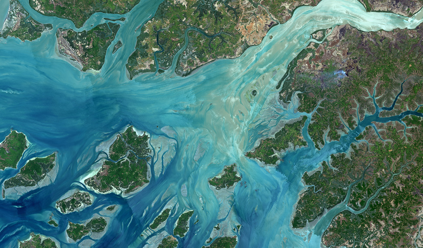

# Bissagos Islands

The [Bissagos Islands](https://en.wikipedia.org/wiki/Bissagos_Islands) form an archipelago off the coast of Guinea-Bissau, as the Geba River empties into the Atlantic Ocean.

[View Map](http://www.openstreetmap.org/#map=10/11.6677/-15.5869)

Source: [ESA Landsat 8](http://www.esa.int/spaceinimages/Images/2014/01/Guinea-Bissau_and_the_Bissagos_islands)
