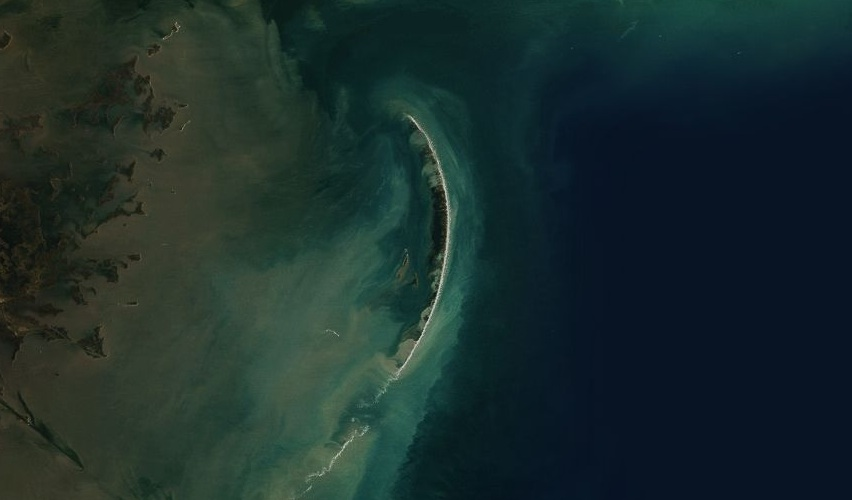

# Chandeleur

The [Chandeleur Island](http://en.wikipedia.org/wiki/Chandeleur_Islands) chain in the Gulf of Mexico. These barrier islands formed from ancient delta deposits from the Mississippi River thousands of years ago.

