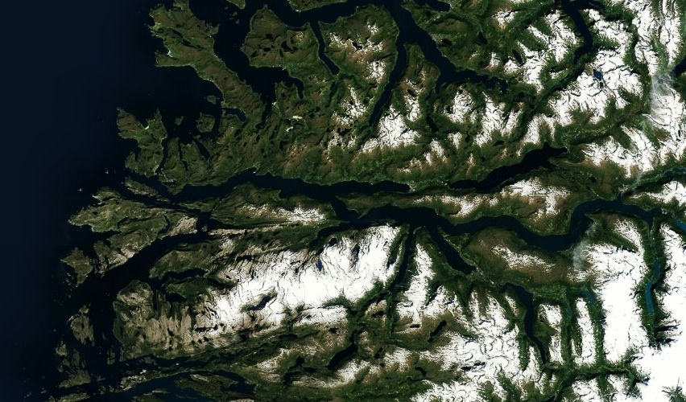

# Fjords

The famous [Nordfjord](http://en.wikipedia.org/wiki/Nordfjord) of Norway and the chasmed region of [Sogn og Fjordane](http://en.wikipedia.org/wiki/Sogn_og_Fjordane) and [Møre og Romsdal](http://en.wikipedia.org/wiki/Sogn_og_Fjordane).

[View Map](http://a.tiles.mapbox.com/v3/colemanm.map-h3n78ecg.html#9.00/62.0753/6.1344)

