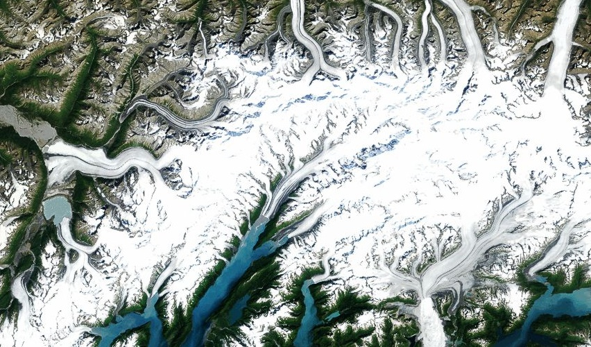

# Glaciers

The glaciers and snow-capped peaks of the [Chugach National Forest](http://en.wikipedia.org/wiki/Chugach_National_Forest) in southern Alaska. Visible are the massive [Columbia](http://ak.water.usgs.gov/glaciology/columbia/) [Harvard](http://en.wikipedia.org/wiki/Harvard_Glacier), and [Yale](http://en.wikipedia.org/wiki/Yale_Glacier) Glaciers (from west to east in frame). Many glaciers in the area were named for elite colleges during the [Harriman Expedition](http://en.wikipedia.org/wiki/Harriman_Alaska_Expedition) of 1899 (along with College Fjord).

[View Map](http://a.tiles.mapbox.com/v3/colemanm.map-h3n78ecg.html#9.00/61.2937/212.2709)

