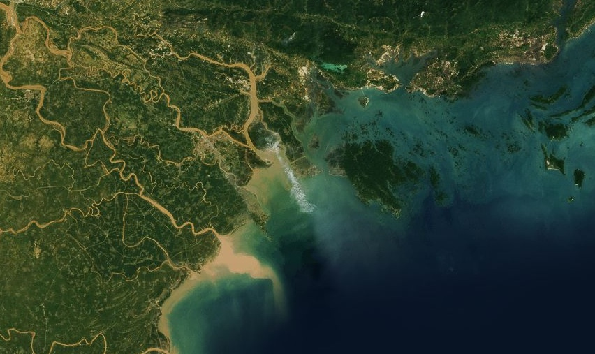

# Ha Long Bay

Vietnam's [Ha Long Bay](http://en.wikipedia.org/wiki/Ha_Long_Bay) is famous for its pillar-like [limestone formations](http://www.interlineres.com/upload/images/Vietnam/Halong%20Bay%20Vietnam.jpg) formed over thousands of years of [karsting](http://en.wikipedia.org/wiki/Karst) activity. Among the bay's limestone seascape sits the island of Cát Bà, home to a large [national park](http://en.wikipedia.org/wiki/Cat_Ba_National_Park). Flowing into the bay are the instrumental rivers of Sông Hồng, Sông Chảy, and Thai Binh.

[View Map](http://a.tiles.mapbox.com/v3/colemanm.map-h3n78ecg.html#10.00/20.8569/467.0580)

