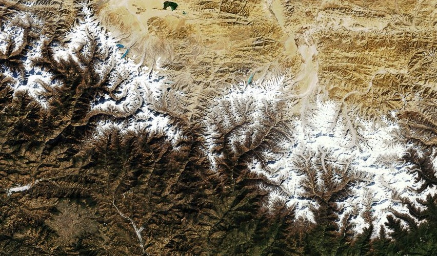

# Himalayas

The Himalayan mountains of eastern Nepal. Through the process of orographic lift, the mountains push humid air upward and condense humidity into precipitation, putting the far side of the mountain range in a "[rain shadow](http://en.wikipedia.org/wiki/Rain_shadow)", creating an arid Tibetan plateau. In the middle are the whitecaps of the range's tallest peaks, with the Himalaya-fed rivers flowing southward from southern Nepal into the Indian state of Bihar. In the northwest is the Tibetan Lake Paiku.

[View Map](http://a.tiles.mapbox.com/v3/colemanm.map-h3n78ecg.html#9.00/28.0722/446.4150)

