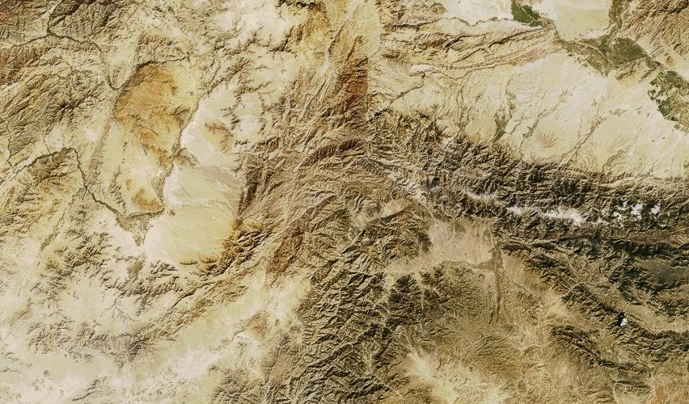

# Hindu Kush

The [Hindu Kush](http://en.wikipedia.org/wiki/Hindu_Kush) range stretches from the northern reaches of Afghanistan southward into central Afghanistan and western Pakistan. In the center of the image is the [Khurram Valley](http://en.wikipedia.org/wiki/Khurram_Valley), a frontier region of the Pakistani FATA province, jutting in toward Kabul between the Afghan cities of Gardēz and Jalalabad.

[View Map](http://a.tiles.mapbox.com/v3/colemanm.map-h3n78ecg.html#9.00/34.1270/429.7482)

