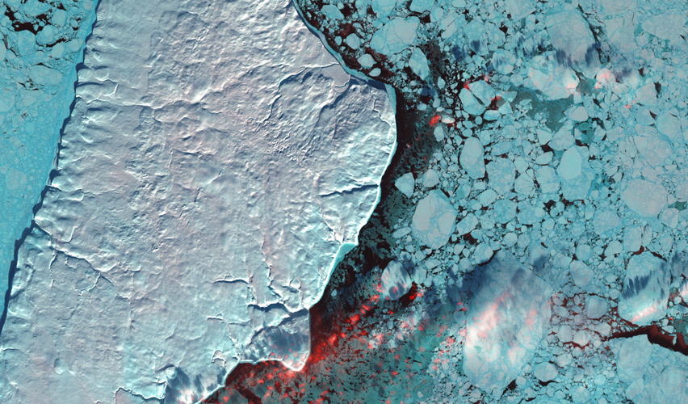

# Akpatok Island

[Akpatok](https://en.wikipedia.org/wiki/Akpatok_Island) is an uninhabited island in the Canadian Arctic, part of the massive [Nunavut](https://en.wikipedia.org/wiki/Nunavut) territory of northeastern Canada. It's a unique limestone formation ringed by steep [500+ foot sheer cliffs](http://davebriggsphotography.com/wp-content/uploads/galleries/post-111/full/p1040227.jpg) rising from [Ungava Bay](https://en.wikipedia.org/wiki/Ungava_Bay). This shot was taken in January 2001 when the island was surrounded by winter ice floes.

[View Map](http://a.tiles.mapbox.com/v3/colemanm.map-h3n78ecg.html#8/60.338/-68.093)

Source: [Landsat 7](http://eros.usgs.gov/imagegallery/earth-art#41)
