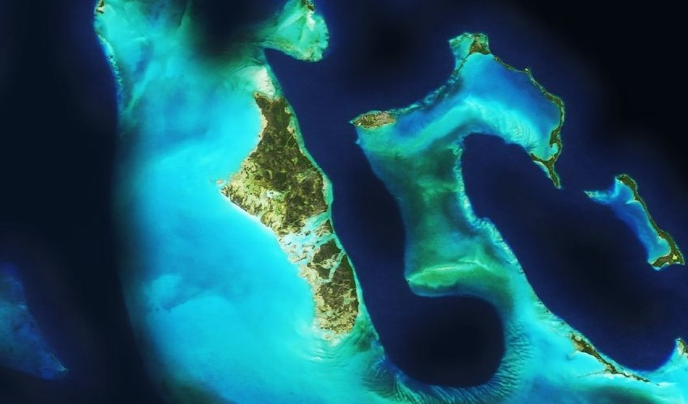

# Andros

The Bahamian island of [Andros](http://en.wikipedia.org/wiki/Andros,_Bahamas) is actually an archipelago, and the largest in the island nation. To the east is the [Tongue of the Ocean](http://en.wikipedia.org/wiki/Tongue_of_the_Ocean), a mile deep trench surrounded by shoals and shallows.

[View Map](http://a.tiles.mapbox.com/v3/colemanm.map-h3n78ecg.html#9.00/24.4547/-77.8848)

Source: [Mapbox](http://mapbox.com)
