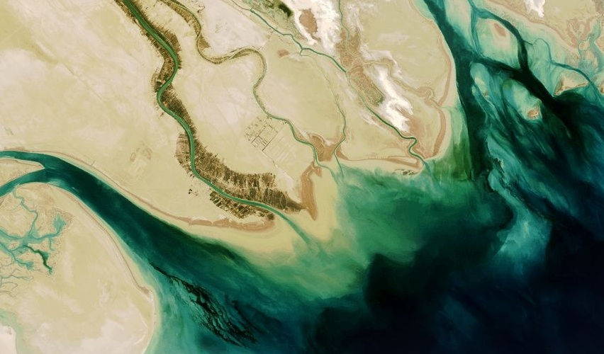

# Oil Delta

The Tigris and Euphrates Rivers (foundation of the "Fertile Crescent") combine north of the Iraqi city of Basrah to form the "[Shatt al-Arab](http://en.wikipedia.org/wiki/Shatt_al-Arab)". The waterway forms the Iran-Iraq border and empties into the Persian Gulf. The Kuwaiti island of [Bubiyan](http://en.wikipedia.org/wiki/Bubiyan_Island) island is visible on the western side, as well as [Marsh Arab](http://en.wikipedia.org/wiki/Marsh_Arabs) settlements lining the waterway in the center.

