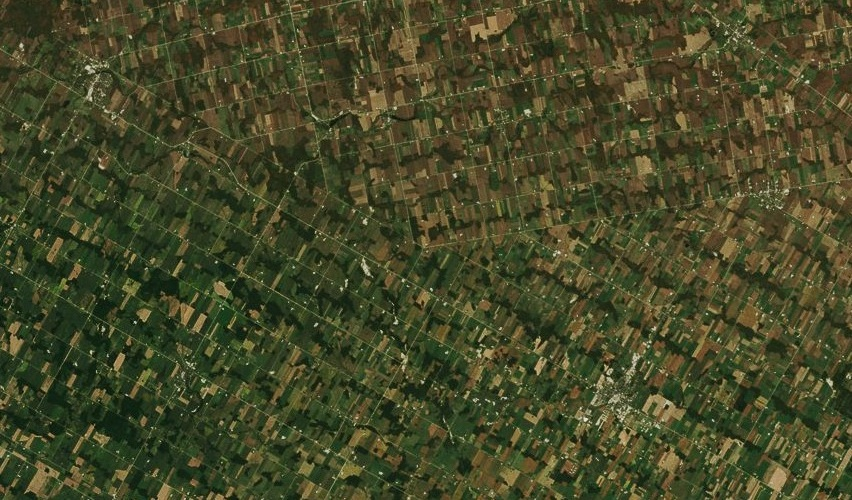

# Ontario

The [southwestern region](http://en.wikipedia.org/wiki/Southwestern_Ontario) of Ontario is an agricultural region, gridded and sliced into plots for cultivation of soybeans, corn, tobacco, and other crops.

[View Map](http://a.tiles.mapbox.com/v3/colemanm.map-h3n78ecg.html#10.00/43.7734/279.1480)

