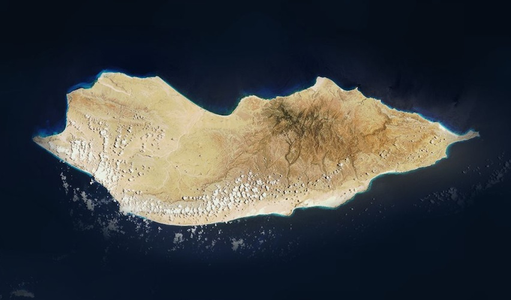

# Socotra

[Socotra](http://en.wikipedia.org/wiki/Socotra) is an island due east of the Horn of Africa. Politically part of the [Hadhramaut](http://en.wikipedia.org/wiki/Hadhramaut_Governorate) Governorate of Yemen, it's home to species of plant and animal life found nowhere else on Earth.

[View Map](http://a.tiles.mapbox.com/v3/colemanm.map-h3n78ecg.html#9.00/12.4348/414.0204)

Source: [Mapbox](http://mapbox.com)
